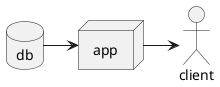

import { Card, CardGrid } from '@astrojs/starlight/components';

## PlantUML

## Next steps

<CardGrid stagger>
  <Card title="Update content" icon="pencil">
    Edit `src/content/docs/index.mdx` to see this page change.
  </Card>
  <Card title="Add new content" icon="add-document">
    Add Markdown or MDX files to `src/content/docs` to create new pages.
  </Card>
  <Card title="Configure your site" icon="setting">
    Edit your `sidebar` and other config in `astro.config.mjs`.
  </Card>
  <Card title="Read the docs" icon="open-book">
    Learn more in [the Starlight Docs](https://starlight.astro.build/).
  </Card>
</CardGrid>
