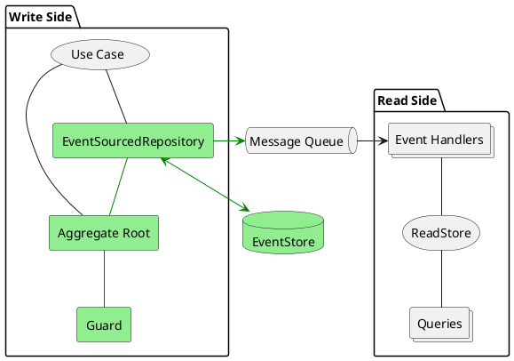

```sh
# Add SimpleDomain to your project
dotnet add package SimpleDomain
```

## CQRS & Event Sourcing in a Nutshell

While storing entities in a database is a common approach, it is not always the best solution.
You typically loose information about the changes that happened to the entity over time. Also, you cannot optimize the
storage for reading or writing. Often times, you need to read data in a different way than you write it, including joins
and aggregations. This is where CQRS and Event Sourcing come into play.

CQRS stands for Command Query Responsibility Segregation. It is a pattern that separates the read and write side of an
application. The write side is responsible for handling use cases and updating the state of the application. The read
side is responsible for handling queries and returning the current state of the application.

Event Sourcing is a pattern that stores all changes to the state of an entity as a sequence of events. This allows you
to rebuild the state of an entity at any point in time by replaying the events. It also allows you to optimize the
storage for reading and writing.

CQRS and Event Sourcing are often used together. They introduce some kind of eventual consistency, meaning that the
ReadStore will eventually be updated after the writing transaction has been completed. Often times, a small delay is
acceptable and the benefits of CQRS and Event Sourcing outweigh the drawbacks.


```plantuml
@startuml
package "Write Side" {
  usecase "Use Case" as usecase
  agent "Aggregate Root" as aggregate #lightgreen
  agent "Guard" as guard #lightgreen
  agent "EventSourcedRepository" as repository #lightgreen

  usecase -- aggregate
  usecase -- repository
  repository -- aggregate #green
  aggregate -- guard #green
}
database EventStore as eventstore #lightgreen
queue "Message Queue" as queue

repository <--> eventstore #green
repository -> queue #green


package "Read Side" {
  collections "Event Handlers" as eventhandlers
  storage "ReadStore" as readstore
  collections "Queries" as queries

  eventhandlers -- readstore
  readstore -- queries
}

queue -> eventhandlers
@enduml
```

## SimpleDomain Features

SimpleDomain offers a set of features to help you implement CQRS and Event Sourcing in your application while mainly
focusing on the write side:

- **EventSourcedRepository**: The EventSourcedRepository is responsible for persisting and loading aggregates. Using an
  EventStream, it can store and load events from an event store in different flavors.
  After storing the events, the repository will publish those events to a MessageQueue for further processing by the ReadStore.
- **Aggregate Root**: Base class for your aggregates. It provides a set of methods to apply events in order to (re)build
  the state of the aggregate as well as keeping the uncommitted events for storing them with the EventSourcedRepository
  in the event store.
- **Guard**: Adds some syntactic sugar to easily check preconditions before applying events to an aggregate.
  If such preconditions are not met, an exception will be thrown.
- **EventStore**: SimpleDomain provides several persistence options for the event store (in-memory, file-based, etc.).

## Testability

SimpleDomain provides an extra package for leveraging the testability of your aggregates. It can be installed in your
unit test projects like this:

```sh
# Add SimpleDomain test support to your test project
dotnet add package SimpleDomain.TestHarness
```

Using the in-memory event store and an in-memory message queue, allows you to write integration tests for the read and
write side of your application without the need for external dependencies, assuming both sides live in the same
assembly.

